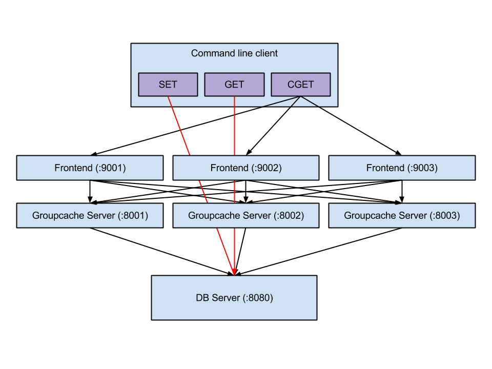

# dCache
dCache 是一个基于 Go 开发的`分布式缓存系统`, 是一个开箱即用的 server 组件   
使用 `Go` + `gRPC` + `etcd` + `singleFlight`


## Features
- 使用 [LRU](./dCache/lru/README.md) 进行缓存淘汰
- 使用 [一致性哈希](./dCache/consistentHash/README.md) 进行节点选择
- 使用 [单机并发控制](./dCache/singleFlight/README.md) 防止缓存击穿与缓存雪崩
- 使用 [gRPC](./dCache/dCachePB/README.md) 实现节点间通信
  - 使用 [Protobuf](./dCache/dCachePB/README.md) 作为序列化方式
- 使用 [etcd](./dCache/register/README.md) 进行服务发现

## Installation
- 构建
```shell
make run
```
- 测试
  - 测试前确保本地已启动 etcd 服务
  - `docker run --name etcd -p 2379:2379 -e ALLOW_NONE_AUTHENTICATION=yes -d binami/etcd:latest`
```shell
make test
```

- 使用:  
借助 Go Modules 然后:
```go
import "github.com/peanutzhen/peanutcache"
```

## 接口
- dCache 通过封装 `Group` 对外提供服务
  - 只提供一个接口
    - Get: 从缓存中获取值
  - Group 也是命名空间, 不同的命名空间之间是相互隔离的

## 架构


- 流程
```
                            是
接收 key --> 检查是否被缓存 -----> 返回缓存值 ⑴
                |  否                         是
                |-----> 是否应当从远程节点获取 -----> 与远程节点交互 --> 返回缓存值 ⑵
                            |  否
                            |-----> 调用`回调函数`，获取值并添加到缓存 --> 返回缓存值 ⑶
```

## License
[MIT](https://choosealicense.com/licenses/mit/)

