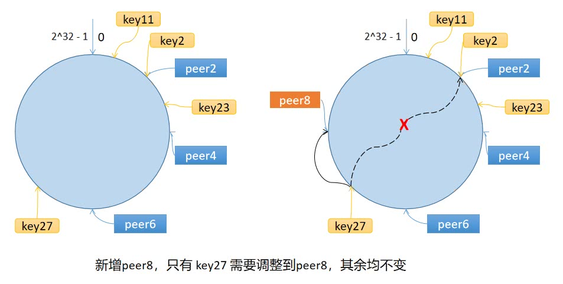

## 一致性哈希
- 一致性哈希算法是一种分布式算法，常用于负载均衡
- 缓存雪崩: 缓存同一时间大面积失效，导致请求全部转发到数据库，造成数据库压力过大，甚至宕机
  - 使用一致性哈希算法，将缓存分散到不同的节点上，避免缓存集中失效

## 原理
- 一致性哈希算法将 key 映射到一个 0-2^32-1 的环上，节点也映射到环上
  - 计算节点/机器(通常使用节点的名称、编号和 IP 地址)的哈希值，放置在环上
  - 计算 key 的哈希值，放置在环上，顺时针寻找到的第一个节点，就是应选取的节点/机器

- 一致性哈希算法在新增/删除节点时, 只需要重新定位该节点附近的一小部分数据,而不需要重新定位所有的节点

## 需要优化的问题
- 数据倾斜
  - 如果服务器的节点过少，容易引起 key 的倾斜
  - 解决方案: 虚拟节点
    - 一个真实节点对应多个虚拟节点
    - 虚拟节点的数量越多，数据分布越均匀
    - 一般情况下，虚拟节点的数量是真实节点的 100 倍 
